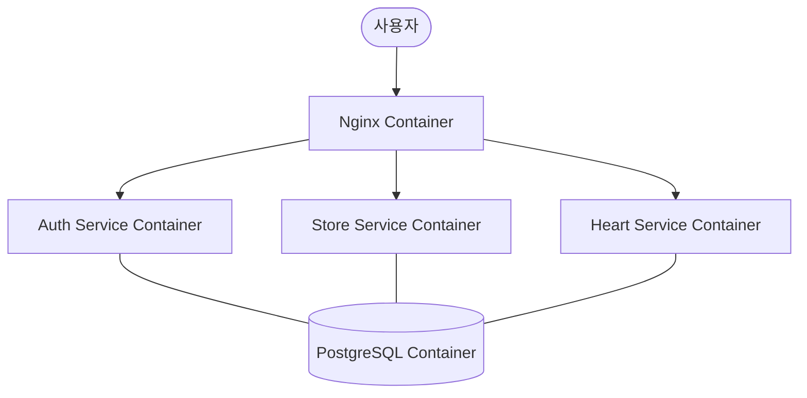

<!-- docs/04-deferred/docker-multi-service-strategy.md -->

# 도커 기반 단일 서버 다중 서비스 운영 전략

이 문서는 비용 절감을 위해 한 대의 AWS Lightsail 인스턴스에서 도커(Docker)를 사용하여 여러 서비스를 독립적으로 운영하기 위한 기술적 구현 및 최적화 전략을 다룹니다.

---

## 1. 아키텍처 개요 (Single Host + Docker)

모든 서비스는 개별 컨테이너로 실행되며, `docker-compose`를 통해 관리됩니다.



- **Reverse Proxy**: Nginx 컨테이너가 도메인에 따라 요청을 각 서비스 컨테이너로 라우팅합니다.
- **Isolation**: 서비스 간의 환경이 격리되어 있어, 한 앱의 오류가 다른 앱에 영향을 주지 않습니다.

---

## 2. 리소스 최적화 전략 (핵심)

단일 서버에서 여러 자바(Spring Boot) 앱을 돌릴 때 가장 큰 걸림돌은 **메모리(RAM)**입니다.

### 2.1 자바 메모리 제한 (`JVM Flags`)
각 스프링 부트 애플리케이션의 힙 메모리를 엄격히 제한해야 합니다.
- **설정 예**: `JAVA_OPTS="-Xms256m -Xmx512m"`
- **기준**: 라이트세일 2GB 램 서버 기준, 3~4개의 앱을 돌리려면 개별 앱의 최대 힙을 512MB 이하로 묶어야 합니다.

### 2.2 도커 메모리 한도 (`mem_limit`)
부득이한 메모리 누수로 인해 전체 서버가 멈추는 것을 방지합니다.
```yaml
services:
  auth-service:
    deploy:
      resources:
        limits:
          memory: 700M # 자바 힙보다 약간 높게 설정
```

### 2.3 Swap 메모리 설정 (AWS Lightsail 필수)
물리 램이 부족할 때 디스크의 일부를 램처럼 사용하는 Swap 파일을 반드시 생성해야 합니다. (최소 2GB~4GB 권장)

---

## 3. 서비스 구성 예시 (`docker-compose.yml`)

```yaml
version: '3.8'
services:
  postgres:
    image: postgres:16
    volumes:
      - ./data/postgres:/var/lib/postgresql/data
    environment:
      POSTGRES_PASSWORD: ${DB_PASSWORD}

  auth-app:
    build: ./auth-service
    environment:
      - JAVA_OPTS=-Xmx512m
    depends_on:
      - postgres

  store-app:
    build: ./store-service
    environment:
      - JAVA_OPTS=-Xmx512m
    depends_on:
      - postgres

  nginx:
    image: nginx:alpine
    ports:
      - "80:80"
      - "443:443"
    volumes:
      - ./nginx/conf.d:/etc/nginx/conf.d
    depends_on:
      - auth-app
      - store-app
```

---

## 4. 장애 대응 및 자동화

- **Health Checks**: 도커 컴포즈의 `healthcheck` 기능을 사용해 앱이 응답하지 않으면 자동으로 컨테이너를 재시작합니다.
- **Restart Policy**: `restart: always`를 설정하여 서버 재부팅 시에도 서비스가 즉시 실행되도록 합니다.
- **Log Management**: 컨테이너 로그가 서버 용량을 채우지 않도록 `logging` 옵션에서 최대 로그 파일 크기를 제한합니다.

---

## 5. 결론

제안된 **"Docker Compose + JVM Tuning"** 전략은 최소한의 비용으로 다중 서비스를 안전하게 운영할 수 있는 최적의 방안입니다. 추후 서비스 규모가 Lightsail 한 대의 한계를 넘어서면, 그때 해당 컨테이너만 별도의 인스턴스로 분리하거나 클라우드 관리형 서비스(예: AWS ECS)로 쉽게 이전할 수 있습니다.
